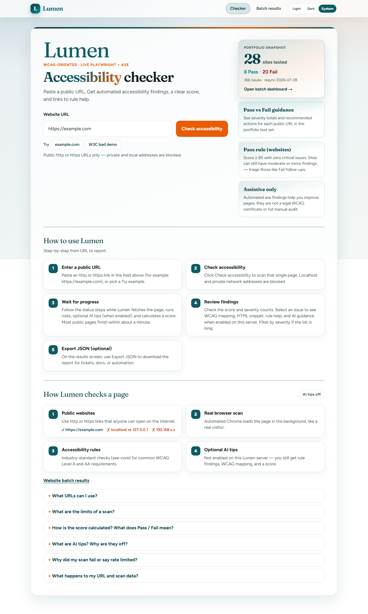
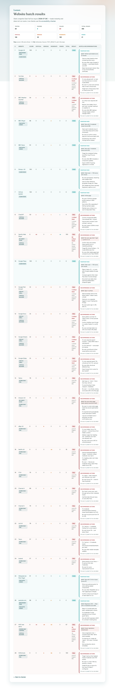
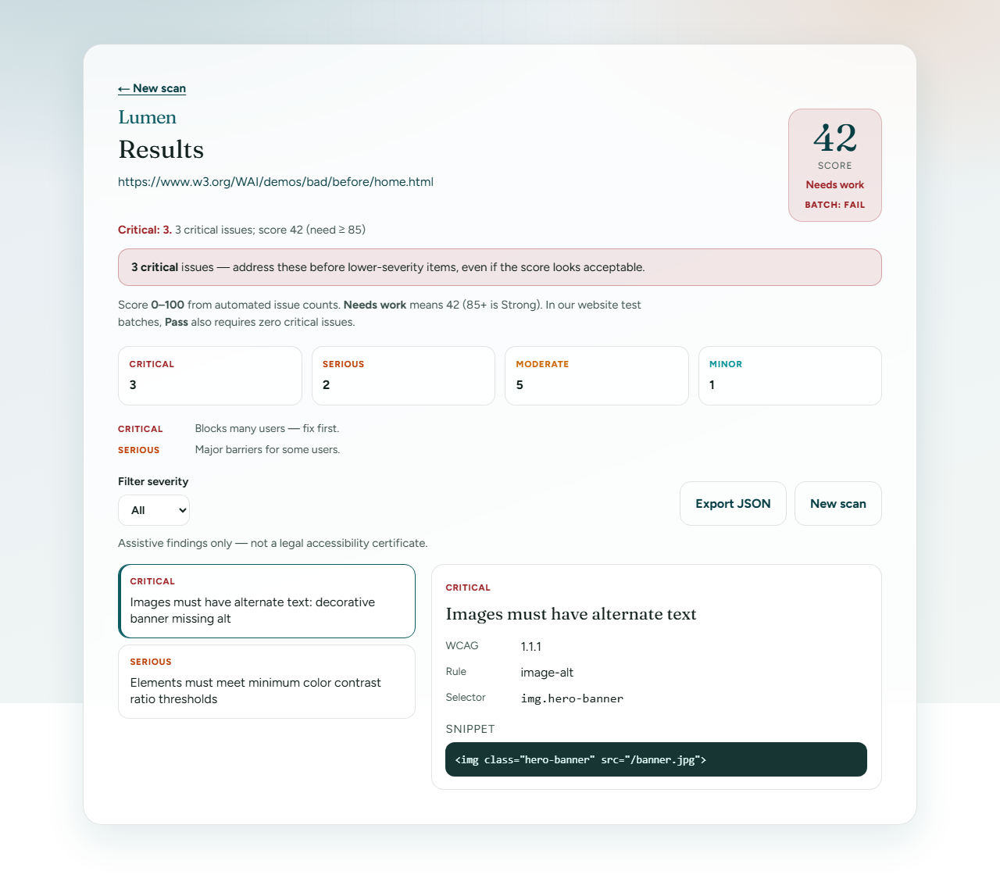
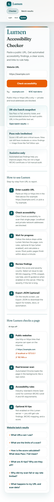

# Lumen — Portfolio Documentation

**AI-Based Web Accessibility Checker**

Repository: https://github.com/balisikh/ai-based-web-accessibility-checker  
Local app: http://localhost:4376

> Assistive findings only — this tool is **not** a legal accessibility certificate or formal conformance audit.

---

## Overview

Lumen scans a public URL for WCAG-oriented accessibility issues, returns a clear score, severity breakdown, and links to rule help. Optional AI tips suggest fixes for top issues.

### What it does

1. Paste a public website URL
2. Lumen opens the page in a headless browser (Chrome via Playwright)
3. **axe-core** checks WCAG A/AA-oriented rules
4. You get a **score**, severity breakdown, and issue details
5. Optionally, **AI tips** explain top issues and suggest fixes
6. Export a **JSON** report

### Stack

- **Frontend / API:** Next.js (React) + TypeScript
- **Scanner:** Playwright (Chrome) + axe-core
- **Data:** Postgres or PGlite
- **AI (optional):** OpenAI-compatible Chat Completions API

---

## UI screenshots (styled layout)

### Home — accessibility checker



### Batch results — 28 public websites



### Results — sample scan layout



### Mobile home (390px)



---

## Layout (light mode)

| Element | Description |
|---------|-------------|
| **Header** | Sticky bar — Lumen logo, Checker / Batch results pills, Light / Dark / System theme |
| **Background** | Soft grey gradient with subtle grid pattern |
| **Main card** | White rounded panel with teal gradient strip along the top |
| **Home CTA** | Orange **Check accessibility** button |
| **Batch CTA** | Teal **Run a live scan** button (top right on desktop) |

---

## Batch snapshot (2026-07-30)

Static dashboard at `/batch` — loads instantly; does not run live scans.

| Metric | Value |
|--------|------:|
| Websites tested | **28** |
| **Passed** | **8** (4 clean · 4 with issues) |
| **Failed** | **20** |
| Total issues | **374** |

### Pass / Fail rule

| Result | Rule |
|--------|------|
| **Pass** | Score **≥ 85** and Critical issues **= 0** |
| **Fail** | Score **< 85** or Critical issues **≥ 1** |

### Sites that passed

Google UK, BBC iPlayer, BBC News, Disney+ UK, GitHub (balisikh), Google Maps, Wikipedia (en Main Page), example.com

### Severity totals (all 28 scans)

| Critical | Serious | Moderate | Minor |
|---------:|--------:|---------:|------:|
| 144 | 37 | 188 | 5 |

---

## MVP features

| Area | Status |
|------|--------|
| Scan UI (home → progress → results) | Done |
| Live Playwright + axe-core analysis | Done |
| URL validation + SSRF protections | Done |
| Per-IP rate limiting | Done |
| Persistence (Postgres or local PGlite) | Done |
| JSON export | Done |
| Optional AI enrichment | Done |
| Anonymous use (no login) | Done |
| PDF export / accounts / crawl | Not yet |

---

## Quick start

```bash
cd web
npm install
npm run dev
```

Open **http://localhost:4376**

On memory-limited Windows machines:

```powershell
npm run build:low-mem
npm run start:low-mem
```

Or if the page shows **plain white text** (no colours or layout):

```powershell
cd web
.\scripts\fix-styles.ps1
```

---

## Local development note — plain-text UI incident (Aug 2026)

During local testing, the app briefly appeared as **unstyled plain text** (e.g. `LLumenCheckerBatch results…` run together). The design and CSS in the repo were **not removed** — styles failed to load at runtime.

### What happened

| Symptom | Cause |
|---------|--------|
| White page, black plain text | HTML loaded but **CSS did not** |
| Nav labels run together | No spacing/styles from `globals.css` |
| Looked like “84 passed” in overview | Numbers ran together when copied without layout |

The browser requested a CSS file (e.g. `/_next/static/css/….css`) but the file returned **500 Internal Server Error** — often from a **stale or corrupt `.next` build** still running on port 4376.

On **low-memory Windows**, Next.js 16 **Turbopack** could also crash while compiling `globals.css` (~2.4k lines + Tailwind v4), leaving a broken build that still served HTML.

### What we fixed (commit `541ec96`)

1. **`dev` and `build` default to webpack** — more stable than Turbopack on low RAM  
2. **`web/scripts/fix-styles.ps1`** — stops old server, deletes `.next`, rebuilds, restarts  
3. **Troubleshooting docs** in `web/README.md` — how to confirm CSS returns **200** in DevTools → Network  

### Resolution

After a clean rebuild and fresh server, the UI matched the screenshots again: sticky header, gradient background, white card with teal strip, overview tiles, and batch table. Screenshots in this document show the **intended styled layout**.

---

## Disclaimer

Lumen helps teams find and understand accessibility issues faster. It does **not** replace a professional audit, and results should not be treated as legal proof of WCAG conformance.

---

*Document generated from project README and demo screenshots in `docs/screenshots/`.*
